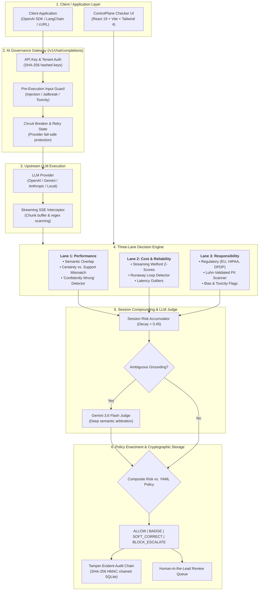

# ControlPlane Checker

ControlPlane Checker is an enterprise-grade AI trust, governance, and real-time observability control plane. It functions as both an inline reverse-proxy gateway (`/v1/chat/completions`) and sidecar inspection plane that intercepts prompts, retrieved context, and generated completions. The engine scores interactions across **Performance**, **Cost**, and **Responsibility** in real-time, enforcing granular policy tiers (`ALLOW`, `BADGE`, `SOFT_CORRECT`, `BLOCK_ESCALATE`) with autonomous Gemini LLM Judge arbitration, streaming Server-Sent Events (SSE) token interception, cryptographic tamper-evident audit chaining, and GitOps YAML policy management.

[](https://opensource.org/licenses/Apache-2.0)
[](https://react.dev/)
[](https://www.typescriptlang.org/)
[](https://vitejs.dev/)
[](https://tailwindcss.com/)
[](https://expressjs.com/)
[](https://www.sqlite.org/)
[](https://www.docker.com/)
[](https://vitest.dev/)
[](https://ai.google.dev/)

For full source code and documentation, visit the [GitHub repository](https://github.com/lucifer-135/ControlPlane-Checker-Enterprise-AI-Trust-Governance).

Submit bug reports, feature suggestions, or track changes in the [issue queue](https://github.com/lucifer-135/ControlPlane-Checker-Enterprise-AI-Trust-Governance/issues).

## Table of contents

- [Overview and problem statement](#overview-and-problem-statement)
- [Requirements](#requirements)
- [Recommended tools](#recommended-tools)
- [Installation](#installation)
- [Configuration](#configuration)
- [Running the application](#running-the-application)
- [Docker deployment](#docker-deployment)
- [Automated test suite](#automated-test-suite)
- [Solution architecture](#solution-architecture)
- [The three governance lanes](#the-three-governance-lanes)
- [AI governance gateway & stream interception](#ai-governance-gateway--stream-interception)
- [Cryptographic audit chain & tamper verification](#cryptographic-audit-chain--tamper-verification)
- [GitOps YAML policy engine](#gitops-yaml-policy-engine)
- [Four-tier policy enactment](#four-tier-policy-enactment)
- [REST API reference](#rest-api-reference)
- [Key platform features](#key-platform-features)
- [Technology stack and dependencies](#technology-stack-and-dependencies)
- [Security and privacy posture](#security-and-privacy-posture)
- [Project directory layout](#project-directory-layout)
- [Troubleshooting](#troubleshooting)
- [FAQ](#faq)
- [Maintainers](#maintainers)
- [License](#license)

## Overview and problem statement

Enterprises deploying Generative AI models into mission-critical workflows face five catastrophic failure modes:

1. **Confidently Wrong Hallucinations**: Models asserting ungrounded claims with high linguistic conviction (e.g. inventing refund warranties, fabricating clinical guidelines, or promising SLA guarantees).
2. **Operational & Cost Outliers**: Runaway recursive tool calls, prompt loops, and token spikes exhausting inference infrastructure budgets.
3. **Regulatory & PII Leaks**: Silent leakage of Personally Identifiable Information (SSN, credit cards with Luhn checksum validation, patient data) violating EU AI Act, HIPAA, FINRA, or India DPDP Act.
4. **Session Drift**: Compounding risk across multi-turn sessions where isolated turns seem harmless but cumulative interactions breach policy boundaries.
5. **Adversarial Injections & Tampering**: Prompt injection, jailbreaking, and untracked triage decisions without verifiable audit trails.

**ControlPlane Checker** addresses these vulnerabilities with an inline proxy gateway and real-time observability control plane. It evaluates inputs via deterministic sub-millisecond heuristics, maintains cryptographic SHA-256 HMAC audit chains in SQLite, dynamically escalates borderline grounding to a live **Gemini 3.6 Flash LLM Judge**, and intercepts token streams in flight.

## Requirements

- **Node.js**: Version `20.0.0` or higher LTS recommended (`18.0.0+` supported)
- **Package Manager**: [npm](https://www.npmjs.com/) (bundled with Node.js) or [bun](https://bun.sh/)
- **C/C++ Build Tools**: Required for native `better-sqlite3` compilation (`make`, `g++`, or Visual Studio Build Tools on Windows)
- **Docker & Docker Compose** (Optional): For containerized deployments

## Recommended tools

- **[Google AI Studio Gemini API Key](https://aistudio.google.com/app/apikey)**: Recommended for live, autonomous LLM Judge arbitration and deep semantic evaluation. If omitted, the system operates seamlessly using deterministic local heuristics.
- **[Docker Desktop](https://www.docker.com/products/docker-desktop/)**: For single-command isolated container deployment.

## Installation

1. Clone the repository:

   ```bash
   git clone https://github.com/lucifer-135/ControlPlane-Checker.git
   cd ControlPlane-Checker
   ```

2. Install dependencies:
   ```bash
   npm install
   ```

## Configuration

1. Copy the environment configuration template:

   ```bash
   cp .env.example .env
   ```

2. Edit `.env` to configure your server parameters and API credentials:

   ```env
   # Google Gemini API key for live LLM Judge features (optional)
   GEMINI_API_KEY="your_gemini_api_key_here"

   # Upstream LLM providers for the Governance Gateway (optional)
   OPENAI_API_KEY=""
   ANTHROPIC_API_KEY=""

   # Server port (default: 3000)
   PORT=3000

   # Cryptographic secret for audit log HMAC chaining
   AUDIT_HMAC_SECRET="controlplane-enterprise-audit-secret-2026"

   # Node environment
   NODE_ENV=development
   ```

3. **Policy Profiles**: Policies are stored as human-readable YAML documents in [`./policies/`](policies/) (`customer-support.yaml`, `decision-support.yaml`, `internal-copilot.yaml`). Modifications are hot-reloaded live without server restarts.

## Running the application

### Development mode

Starts the Express backend with hot-reloading policy watchers and Vite development server:

```bash
npm run dev
```

Open your browser at:

```
http://localhost:3000
```

### Production build & execution

1. Build the client bundle and compile the backend server bundle:

   ```bash
   npm run build
   ```

2. Start the production server:
   ```bash
   npm start
   ```

### Additional commands

- `npm run lint`: Static TypeScript type checking via `tsc --noEmit`.
- `npm run test`: Executes the complete Vitest test suite.
- `npm run test:coverage`: Generates test coverage reports with v8.
- `npm run format`: Formats codebase with Prettier.
- `npm run clean`: Cleans generated build artifacts in `dist/`.

## Docker deployment

ControlPlane Checker includes a multi-stage `Dockerfile` and `docker-compose.yml` for isolated enterprise deployment with persistent storage.

### Using Docker Compose

```bash
# Build and start container in detached mode
docker compose up -d --build

# View container logs
docker compose logs -f

# Check container health status
docker compose ps
```

The container automatically mounts:

- `./data`: Stores the persistent SQLite database (`controlplane.db`, WAL, and SHM files).
- `./policies`: Live-mounted directory for GitOps YAML policy hot-reloading.

## Automated test suite

The platform includes a test suite covering the three governance lanes, cryptographic audit chains, SQLite persistence, SSE stream interception, circuit breaking, input guards, and Luhn checksum validation.

```bash
# Run unit and integration tests
npm run test
```

### Test coverage areas

| Test Suite              | File                                       | Tests | Coverage                                                    |
| :---------------------- | :----------------------------------------- | :---: | :---------------------------------------------------------- |
| **Input Guard**         | `src/server/inputGuard.test.ts`            |   7   | Jailbreaks, prompt injection, system prompt leak detection  |
| **Luhn Checksum**       | `src/lib/utils/luhn.test.ts`               |  15   | Credit card checksum validation, false positive suppression |
| **Audit Chain**         | `src/server/db/auditChain.test.ts`         |   4   | SHA-256 HMAC tamper detection, integrity verification       |
| **Database Adapter**    | `src/server/db/database.test.ts`           |   4   | SQLite persistence, review decisions, tenant API keys       |
| **Policy Loader**       | `src/server/policyLoader.test.ts`          |   3   | YAML parsing, schema validation, fallback defaults          |
| **Rolling Baselines**   | `src/server/rollingBaseline.test.ts`       |   3   | Welford algorithm streaming mean & standard deviation       |
| **Performance Lane**    | `src/lib/lanes/performanceLane.test.ts`    |   8   | Grounding score, Certainty-Support Mismatch, CW detection   |
| **Responsibility Lane** | `src/lib/lanes/responsibilityLane.test.ts` |  15   | SSN, email, phone, credit card, bias, regulatory rulesets   |
| **Stream Interceptor**  | `src/server/streamInterceptor.test.ts`     |   2   | Real-time SSE token interception, emergency hard cutoff     |
| **Circuit Breaker**     | `src/server/circuitBreaker.test.ts`        |   6   | Open/half-open/closed state transitions, cooldown timers    |
| **Decision Engine**     | `src/lib/decisionEngine.test.ts`           |   8   | Composite scoring, multi-lane overlaps, session decay       |

## Solution architecture



## The three governance lanes

### 1. Performance & Groundedness Lane

- **N-Gram & Jaccard Grounding**: Computes token-level and phrase-level overlap against retrieved RAG documents.
- **Certainty vs. Support Mismatch**: Identifies linguistic assertiveness (_"guaranteed"_, _"without question"_, _"strictly mandates"_) unsupported by reference context, flagging `"Confidently Wrong"` hallucinations.
- **LLM Judge Arbitration**: Automatically hands off ambiguous cases (grounding scores between 0.35–0.60) to Gemini Flash for deep semantic verification.

### 2. Cost & Operational Reliability Lane

- **Streaming Welford Algorithm**: Continuously calculates running mean ($\mu$) and standard deviation ($\sigma$) per use-case and query type without storing historic vectors.
- **Z-Score Outlier Flagging**: Intercepts token bloat ($Z_{tokens} > 2.5$) and latency spikes ($Z_{latency} > 3.0$).
- **Runaway Loop Detection**: Flags recursive agentic patterns where completion tokens or tool invocations exceed safety envelopes.

### 3. Responsibility, PII & Regulatory Compliance Lane

- **Luhn Algorithm Validation**: Validates candidate credit card strings with the modulo-10 Luhn algorithm to eliminate false positive numeric matches.
- **Context-Aware PII Detection**: High-precision regex engines for SSN, Aadhaar, email addresses, phone numbers, and cloud API keys (AWS, Bearer tokens).
- **Jurisdiction-Specific Frameworks**:
  - **EU AI Act Standard**: Mandatory high-risk transparency tagging and PII redaction.
  - **US HIPAA & FINRA**: Patient health identifier detection and financial advice warnings.
  - **India DPDP Act**: Digital personal data protection, Aadhaar masking.
- **Hard Governance Overrides**: Critical violations (exposed SSN, active credit card, hate speech) trigger immediate `BLOCK_ESCALATE` regardless of other lane scores.

## AI governance gateway & stream interception

ControlPlane Checker provides an OpenAI-compatible reverse-proxy endpoint at `/v1/chat/completions`:

- **Drop-in Client Compatibility**: Works out of the box with standard `openai-python`, `openai-node`, LangChain, and LlamaIndex configurations.
- **Pre-Execution Input Guard**: Analyzes prompts before reaching the model to block prompt injections, jailbreaks, and sensitive data uploads.
- **Real-Time Streaming SSE Interceptor**: Inspects Server-Sent Events token streams chunk-by-chunk. If a hard violation appears mid-stream (such as an unmasked Social Security Number or credit card), the proxy immediately truncates the stream, appends an emergency governance disclaimer, and logs the incident.
- **Circuit Breaker**: Detects downstream provider failures and opens the circuit after consecutive errors, serving graceful fallbacks and automatically probing for recovery.

## Cryptographic audit chain & tamper verification

Every evaluation is recorded into a persistent SQLite database (`better-sqlite3` in WAL mode) with an immutable cryptographic HMAC-SHA256 chain:

1. **Hash Chaining**: Each record computes its SHA-256 signature by hashing its payload together with the `current_hash` of the preceding record:

   $$\text{Hash}_n = \text{HMAC-SHA256}(\text{Record}_n \mathbin{\Vert} \text{Hash}_{n-1}, \text{Secret})$$
2. **Tamper Detection**: If any row is modified, deleted, or inserted out of sequence in the database file, the hash chain breaks.
3. **Verification API**: Call `GET /api/audit-logs/verify` to verify the mathematical integrity of all audit records. The endpoint returns `INTEGRITY_VERIFIED` or pinpointed details on any detected tampering.

## GitOps YAML policy engine

Policies are stored as YAML documents in [`./policies/`](policies/) and watched at runtime:

```yaml
id: customer-support
name: Customer Support Bot Policy
version: 2.4.1-prod
enforcement_mode: inline_blocking
weights:
  performance: 0.50
  cost: 0.15
  responsibility: 0.35
thresholds:
  badge: 0.25
  soft_correct: 0.50
  block_escalate: 0.70
rules:
  performance:
    grounding_floor: 0.40
    cw_mismatch_limit: 0.45
  responsibility:
    pii_action: BLOCK
    disallow_profanity: true
```

- **Live Hot-Reload**: Editing a YAML policy file updates server enforcement in memory within milliseconds without server restarts.
- **Version Tracking**: Policy changes are tracked with semantic versioning tags for GitOps audit compliance.

## Four-tier policy enactment

| Tier                 | Condition / Threshold                                  | Enactment Action                                                                             | Latency Overhead             |
| :------------------- | :----------------------------------------------------- | :------------------------------------------------------------------------------------------- | :--------------------------- |
| **`ALLOW`**          | Composite Risk $< \theta_{badge}$                      | Interaction passes unimpeded; detailed audit telemetry persisted.                            | $\approx 0\text{ ms}$        |
| **`BADGE`**          | $\theta_{badge} \le \text{Risk} < \theta_{soft}$       | Appends visual confidence indicators and source verification badges to UI.                   | $+35\text{ ms}$              |
| **`SOFT_CORRECT`**   | $\theta_{soft} \le \text{Risk} < \theta_{block}$       | Prepends safety disclaimers, inserts hedging syntax, or links retrieved context docs.        | $+45\text{ ms}$              |
| **`BLOCK_ESCALATE`** | $\text{Risk} \ge \theta_{block}$ OR Critical Violation | Intercepts response before rendering; generates safe fallback message; routes to HITL Queue. | $+140\text{ ms}$ (pre-block) |

## REST API reference

| Endpoint                    |  Method  | Description                                                        |
| :-------------------------- | :------: | :----------------------------------------------------------------- |
| `/v1/chat/completions`      |  `POST`  | OpenAI-compatible reverse proxy with streaming SSE interception    |
| `/api/evaluate`             |  `POST`  | Evaluates a single interaction across all three governance lanes   |
| `/api/evaluate/batch`       |  `POST`  | Batch evaluation of dataset against active policy profiles         |
| `/api/policies`             |  `GET`   | Retrieves all active YAML policy profiles                          |
| `/api/policies/:useCase`    |  `PUT`   | Updates a specific policy profile at runtime                       |
| `/api/policies/reset`       |  `POST`  | Resets policy profiles to YAML baseline configurations             |
| `/api/baselines`            |  `GET`   | Retrieves current Welford empirical distributions ($\mu, \sigma$)  |
| `/api/baselines/observe`    |  `POST`  | Feeds a new token/latency observation into the Welford accumulator |
| `/api/audit-logs`           |  `GET`   | Retrieves paginated audit trail records                            |
| `/api/audit-logs/verify`    |  `GET`   | Verifies cryptographic HMAC-SHA256 chain integrity                 |
| `/api/review-decisions`     |  `GET`   | Queries persisted Human-in-the-Lead review decisions               |
| `/api/review-decisions`     |  `POST`  | Persists an HITL triage decision to SQLite                         |
| `/api/review-decisions/:id` | `DELETE` | Deletes a specific review decision and returns item to queue       |
| `/api/review-decisions`     | `DELETE` | Resets / clears all recorded review decisions                      |
| `/api/keys`                 |  `POST`  | Generates a new tenant API key with rate limits                    |
| `/api/metrics`              |  `GET`   | Exports Prometheus metrics text format                             |
| `/api/judge`                |  `POST`  | Invokes Gemini 3.6 Flash LLM Judge for semantic arbitration        |
| `/api/health`               |  `GET`   | Server health check and API key readiness status                   |

## Key platform features

### 1. Executive Telemetry Dashboard

- High-level KPIs: Total Audited Volume, Block Rate, Confidently Wrong Hallucination Rate, PII Leaks Blocked, and Average Governance Overhead.
- Interactive multi-dimensional charts: Risk Distribution by Lane (Recharts), Hourly Volume vs. Blocks, and Cross-Use-Case Governance Matrix.
- Quick Triage widget displaying the latest high-risk escalations with instant review actions.

### 2. Live Telemetry Stream

- Real-time simulation of incoming enterprise AI interactions across Customer Support, Internal Copilots, and Decision Support agents.
- Playback controls: Play/Pause, Step forward 1 interaction, 1x/2x/5x speed selectors, and instant stream rendering.
- Telemetry inspection view with token breakdown, latency gauges, triggering span highlights, and 1-click **Gemini LLM Judge** execution.

### 3. Frontline Human Review Queue

- Human-in-the-Lead (HITL) adjudication portal for blocked or escalated interactions.
- Side-by-side prompt, retrieved context, and model output view with colored span highlights.
- 1-click arbitration actions: **Approve & Release**, **Overturn & Correct**, **Escalate to Legal/Security**, or **Trigger Gemini LLM Judge**.
- Adjudications are persisted directly to SQLite with automated session audit logging.
- **Delete / Reset Recorded Decisions**: Individual decisions can be deleted to return specific interactions back to the active review queue, or reset completely in bulk with confirmation to clear the session review state.

### 4. Policy Studio

- Tailor governance parameters per use-case (`support_bot`, `internal_copilot`, `decision_support`).
- Configure lane weights (Performance vs. Cost vs. Responsibility), trigger thresholds, and regulatory regimes (EU AI Act, HIPAA/FINRA, DPDP).
- Real-time synchronization with server-side YAML policies.

### 5. Trust Metrics & Tradeoff Dial

- Interactive Confusion Matrix calculating True Positives, False Positives, True Negatives, and False Negatives against labeled ground truth.
- Precision-Recall Curve and False Positive Rate (FPR) vs. Block Rate trade-off slider.
- Real-time SLA impact estimation and false escalation cost projections.

### 6. Interactive Sandbox Lab

- Live testing harness to input custom prompts, retrieved contexts, and candidate responses.
- Evaluates inputs in real-time across all three lanes and provides on-demand Gemini 3.6 Flash judge evaluations.

## Technology stack and dependencies

| Component              | Technology                                                                     | Purpose                                                    |
| :--------------------- | :----------------------------------------------------------------------------- | :--------------------------------------------------------- |
| **Frontend Framework** | [React 19](https://react.dev/) + [TypeScript](https://www.typescriptlang.org/) | Type-safe UI state management and component lifecycle      |
| **Build Tooling**      | [Vite 6](https://vitejs.dev/)                                                  | Sub-millisecond HMR and optimized production bundling      |
| **Styling**            | [Tailwind CSS 4](https://tailwindcss.com/)                                     | Modern design system, frosted glassmorphism, fluid layouts |
| **Data Visualization** | [Recharts 3](https://recharts.org/)                                            | Responsive telemetry and governance metric charts          |
| **Icons & Visuals**    | [Lucide React](https://lucide.dev/)                                            | Modern visual iconography                                  |
| **Database Engine**    | [better-sqlite3](https://github.com/WiseLibs/better-sqlite3)                   | High-throughput embedded SQLite database in WAL mode       |
| **Policy Parser**      | [js-yaml](https://github.com/nodeca/js-yaml)                                   | YAML policy file parsing and schema validation             |
| **Backend Server**     | [Express](https://expressjs.com/) (Node.js)                                    | REST API, SSE streaming proxy, and static file serving     |
| **AI LLM Judge**       | [@google/genai](https://www.npmjs.com/package/@google/genai)                   | Server-side integration with Gemini 3.6 / 2.5 Flash models |
| **Server Bundler**     | [esbuild](https://esbuild.github.io/)                                          | Fast bundling of backend TypeScript into `dist/server.cjs` |
| **Test Runner**        | [Vitest 3](https://vitest.dev/)                                                | Unit testing and v8 code coverage analysis                 |
| **Containerization**   | [Docker](https://www.docker.com/)                                              | Multi-stage production container with health checks        |

## Security and privacy posture

- **Zero Client-Side Key Exposure**: The `GEMINI_API_KEY` is strictly accessed on the server. No credentials or keys are bundled or transmitted to the client.
- **Fail-Safe Heuristic Simulation**: In air-gapped environments or scenarios where `GEMINI_API_KEY` is omitted, the platform gracefully switches to deterministic semantic and statistical heuristics without failing requests.
- **Cryptographic Audit Trail**: Immutable SHA-256 HMAC hash chaining ensures all evaluation records and HITL triage decisions are tamper-evident.
- **Luhn Algorithm Validation**: Credit card scanning uses algorithmic checksum verification, preventing false-positive customer ID matches while ensuring real financial leaks are caught.
- **Streaming Token Interception**: SSE token streams are inspected chunk-by-chunk with immediate stream termination if PII or credentials appear.
- **Strict Environment Isolation**: All `.env*` files are excluded from version control via `.gitignore`.
- **Zero Known Vulnerabilities**: Verified clean with `npm audit` (0 vulnerabilities).

## Project directory layout

```
ControlPlane-Checker/
├── .env.example              # Sanitized environment template
├── .gitignore                # Comprehensive Git exclusion rules
├── .dockerignore             # Docker build exclusion rules
├── Dockerfile                # Multi-stage production Docker build
├── docker-compose.yml        # Docker Compose configuration with volume mounts
├── index.html                # HTML entrypoint & typography configuration
├── package.json              # Dependencies, build scripts & metadata
├── tsconfig.json             # TypeScript compiler settings
├── vite.config.ts            # Vite & Tailwind CSS bundler configuration
├── server.ts                 # Express server, gateway proxy & API endpoints
├── policies/                 # GitOps YAML Policy Profiles
│   ├── customer-support.yaml # Support Bot policy configuration
│   ├── decision-support.yaml # Decision Support strict policy
│   └── internal-copilot.yaml # Internal Copilot balanced policy
├── data/                     # Persistent SQLite storage
│   └── controlplane.db       # Database file (WAL mode, auto-created)
├── src/
│   ├── main.tsx              # React DOM mounting
│   ├── App.tsx               # Main application controller & tab orchestration
│   ├── types.ts              # Domain types (Lanes, Tiers, Policies, Telemetry)
│   ├── index.css             # Tailwind 4 theme & custom glassmorphism styles
│   ├── components/           # UI Components & Tabs
│   │   ├── AmbientShaderBackground.tsx # Hardware-accelerated CSS ambient mesh
│   │   ├── DashboardTab.tsx            # Executive KPI & overview charts
│   │   ├── GeminiJudgeResultCard.tsx   # LLM Judge evaluation breakdown card
│   │   ├── Header.tsx                  # Global navigation bar & tester trigger
│   │   ├── InteractionTesterModal.tsx  # Live interactive sandbox tester
│   │   ├── LiveFeedTab.tsx             # Real-time telemetry feed & stream
│   │   ├── PolicyProfilesTab.tsx       # Per-use-case policy threshold editor
│   │   ├── ReviewQueueTab.tsx          # Frontline HITL adjudication portal
│   │   ├── TrustMetricsTab.tsx         # Confusion matrix & calibration dial
│   │   ├── VerdictBadge.tsx            # Visual tier badge component
│   │   └── WavyDots.tsx                # Visual indicator effects
│   ├── data/                 # Baseline & Synthetic Datasets
│   │   ├── baselines.ts                # Empirical normal distributions
│   │   └── interactions.ts             # Multi-domain synthetic interaction dataset
│   ├── lib/                  # Core Business Logic & Decision Engine
│   │   ├── decisionEngine.ts           # 3-lane aggregator & session compounding
│   │   ├── metrics.ts                  # Confusion matrix & PR calculations
│   │   ├── policyProfiles.ts           # Fallback policy profile definitions
│   │   ├── lanes/                      # Individual Lane Evaluators
│   │   │   ├── costLane.ts             # Z-score outlier & runaway loop detector
│   │   │   ├── performanceLane.ts      # Grounding & Confidently Wrong detector
│   │   │   └── responsibilityLane.ts   # PII scanner, bias & regulatory rulesets
│   │   └── utils/                      # Evaluation Utilities
│   │       ├── contradictionDetector.ts# Lexical contradiction matcher
│   │       ├── entityExtractor.ts      # Entity & keyword extractor
│   │       ├── luhn.ts                 # Modulo-10 Luhn checksum validator
│   │       ├── ngramOverlap.ts         # N-gram context overlap scorer
│   │       └── piiContext.ts           # PII regex patterns & context analyzer
│   └── server/               # Enterprise Server Modules
│       ├── auth.ts                     # API key authentication & rate limiting
│       ├── circuitBreaker.ts           # Fault-tolerant provider circuit breaker
│       ├── gateway.ts                  # OpenAI-compatible chat completions proxy
│       ├── inputGuard.ts               # Prompt injection & jailbreak detection
│       ├── policyLoader.ts             # YAML policy loader & directory watcher
│       ├── rollingBaseline.ts          # Welford algorithm dynamic streaming baseline
│       ├── streamInterceptor.ts        # SSE chunk interceptor & emergency cutter
│       ├── telemetry.ts                # Prometheus metrics formatting
│       └── db/                         # Database Layer
│           ├── auditChain.ts           # SHA-256 HMAC audit chaining & verification
│           ├── database.ts             # SQLite adapter (better-sqlite3)
│           └── schema.sql              # Database DDL schema
└── dist/                     # Production build output (generated)
```

## Troubleshooting

- **Missing Gemini API Key (`GEMINI_API_KEY`)**:
  - If no API key is provided, the backend falls back to deterministic heuristic evaluation. Real-time governance will continue to operate without external network calls.
  - To enable live Gemini LLM Judge features, generate a key at [Google AI Studio](https://aistudio.google.com/app/apikey) and set `GEMINI_API_KEY` in `.env`.
- **Port 3000 already in use**:
  - Update `PORT=3001` (or another available port) in `.env` and restart the server.
- **Native module compilation (`better-sqlite3`)**:
  - Ensure build tools (`make`, `g++` on Linux/macOS or Visual Studio Build Tools on Windows) are installed when installing dependencies. Alternatively, run with Docker.
- **Stale build cache**:
  - Run `npm run clean` followed by `npm run build` to clear and regenerate artifacts in `dist/`.

## FAQ

**Q: Can ControlPlane Checker serve as an inline reverse proxy for existing applications?**

**A:** Yes. ControlPlane Checker exposes an OpenAI-compatible endpoint at `/v1/chat/completions`. You can point any OpenAI SDK client (Python, Node.js, LangChain) directly to `http://localhost:3000/v1` with your ControlPlane API key to gain automatic prompt injection guarding, token streaming interception, and audit logging.

**Q: How does the cryptographic audit chain work?**

**A:** Every evaluation row in the SQLite database includes an HMAC-SHA256 hash that links to the previous row's hash. Any tampering, reordering, or manual row modification can be detected instantly via `GET /api/audit-logs/verify`.

**Q: Can policy rules be managed via GitOps?**

**A:** Yes. All policy profiles are defined as declarative YAML files in `./policies/`. The server watches this directory and hot-reloads changes in real-time, allowing policy updates to be tracked and reviewed in Git.

**Q: How does multi-turn session compounding work?**

**A:** The decision engine tracks session history using an exponential decay accumulator (decay factor $\lambda = 0.45$). Sub-threshold risks across consecutive turns compound, triggering escalations if cumulative risk breaches policy limits.

## Maintainers

- **Shivansh ([lucifer-135](https://github.com/lucifer-135))** - Project Author & Maintainer

## License

This project is licensed under the **Apache-2.0 License**. See the [LICENSE](LICENSE) file for details.
