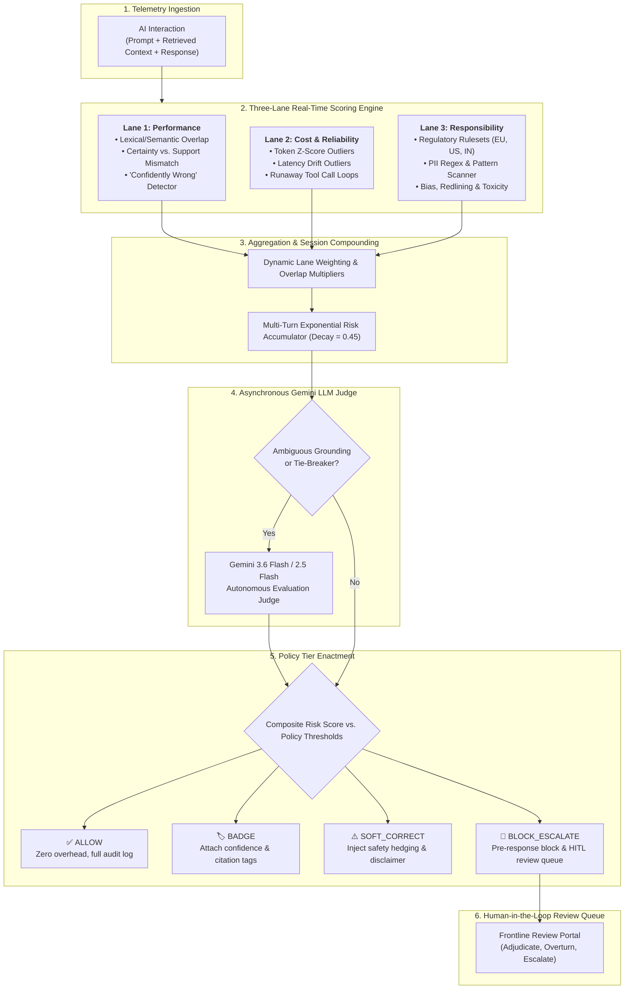

# ControlPlane Checker

ControlPlane Checker is an enterprise-grade AI trust, governance, and real-time observability control plane. It acts as an inline and sidecar trust proxy that intercepts AI prompts, retrieved context documents, and generated responses, scoring interactions across **Performance**, **Cost**, and **Responsibility** in real-time. The platform enforces granular policy tiers (`ALLOW`, `BADGE`, `SOFT_CORRECT`, `BLOCK_ESCALATE`) with autonomous Gemini LLM Judge arbitration.

[](https://opensource.org/licenses/Apache-2.0)
[](https://react.dev/)
[](https://www.typescriptlang.org/)
[](https://vitejs.dev/)
[](https://tailwindcss.com/)
[](https://expressjs.com/)
[](https://ai.google.dev/)

For full source code and documentation, visit the [project page](https://github.com/lucifer-135/ControlPlane-Checker).

Submit bug reports, feature suggestions, or track changes in the [issue queue](https://github.com/lucifer-135/ControlPlane-Checker/issues).


## Table of contents

- [Overview and problem statement](#overview-and-problem-statement)
- [Requirements](#requirements)
- [Recommended tools](#recommended-tools)
- [Installation](#installation)
- [Configuration](#configuration)
- [Running the application](#running-the-application)
- [Solution architecture](#solution-architecture)
- [The three governance lanes](#the-three-governance-lanes)
- [Four-tier policy enactment](#four-tier-policy-enactment)
- [Key platform features](#key-platform-features)
- [Technology stack and dependencies](#technology-stack-and-dependencies)
- [Security and privacy posture](#security-and-privacy-posture)
- [Project directory layout](#project-directory-layout)
- [Troubleshooting](#troubleshooting)
- [FAQ](#faq)
- [Maintainers](#maintainers)
- [License](#license)


## Overview and problem statement

Enterprises deploying Generative AI models into production encounter four catastrophic failure modes:

1. **Confidently Wrong Hallucinations**: Models asserting incorrect facts with high linguistic confidence (such as claiming non-existent refund policies or false regulatory exemptions).
1. **Operational & Cost Blowouts**: Runaway recursive tool calls and token outliers draining infrastructure budgets.
1. **Regulatory & PII Violations**: Silent leakage of Personally Identifiable Information (SSN, credit cards, customer emails) and biased decisions violating the EU AI Act, HIPAA, FINRA, or India DPDP Act.
1. **Session Drift**: Compounding risk across multi-turn user sessions where individual turns appear benign but cumulative interactions violate enterprise boundaries.

**ControlPlane Checker** addresses these challenges by calculating composite risk scores via sub-millisecond heuristics, dynamically escalating ambiguous cases to a live **Gemini 3.6 Flash LLM Judge**, and enforcing policy guardrails before outputs reach end users.


## Requirements

This project requires the following environment and runtime dependencies:

- **Node.js**: Version `18.0.0` or higher (Node 20+ LTS recommended)
- **Package Manager**: [npm](https://www.npmjs.com/) (bundled with Node.js) or [bun](https://bun.sh/)
- **Web Browser**: Modern evergreen browser (Chrome, Edge, Firefox, Safari) with ES2022 and WebGL support


## Recommended tools

- **[Google AI Studio Gemini API Key](https://aistudio.google.com/app/apikey)**: Recommended for live, autonomous LLM Judge verification and deep semantic reasoning. If omitted, the system seamlessly operates using deterministic semantic and statistical heuristics.
- **[Bun](https://bun.sh/)**: High-performance JavaScript/TypeScript package manager and runtime.


## Installation

1. Clone the repository from GitHub:
   ```bash
   git clone https://github.com/lucifer-135/ControlPlane-Checker.git
   cd ControlPlane-Checker
   ```

1. Install project dependencies:
   ```bash
   npm install
   ```


## Configuration

1. Create a local environment configuration file from the template:
   ```bash
   cp .env.example .env
   ```

1. Edit `.env` to configure your server port and optional Google Gemini API credentials:
   ```env
   # Google Gemini API key for live LLM Judge features (optional)
   GEMINI_API_KEY="your_actual_gemini_api_key_here"

   # Server port (default: 3000)
   PORT=3000

   # Node environment
   NODE_ENV=development

   # Base URL
   APP_URL="http://localhost:3000"
   ```

1. **Policy Profiles**: Default policy threshold profiles (`support_bot`, `internal_copilot`, `decision_support`) are defined in [src/lib/policyProfiles.ts](file:///c:/Shivansh/Projects/ControlPlane-Checker-demo/src/lib/policyProfiles.ts) and can be adjusted interactively in the Policy Profiles UI.


## Running the application

### Development mode

Start the integrated Vite development server and Express backend:
```bash
npm run dev
```
Open your browser and navigate to:
```
http://localhost:3000
```

### Production build & execution

1. Build the client bundle and compile the backend server:
   ```bash
   npm run build
   ```

1. Launch the production server:
   ```bash
   npm start
   ```

### Additional commands

- `npm run lint`: Runs TypeScript static type checking without emitting files.
- `npm run preview`: Locally previews the production Vite bundle.
- `npm run clean`: Cleans generated build artifacts in `dist/`.


## Solution architecture




## The three governance lanes

### 1. Performance & Groundedness Lane
- **Lexical & Semantic Context Overlap**: Measures Jaccard and n-gram overlap between generated claims and retrieved grounding snippets.
- **Linguistic Certainty Extraction**: Scans for high-conviction asserting keywords (*"with 100% legal certainty"*, *"guaranteed"*, *"without a doubt"*, *"strictly mandates"*) versus hedging phrases (*"might be"*, *"according to documentation"*).
- **Certainty vs. Support Mismatch**: Calculates the delta between assertiveness and contextual backing. Discrepancies generate a `"Confidently Wrong"` flag.
- **LLM Judge Tie-Breaker**: Automatically hands off ambiguous cases (grounding scores between 0.35–0.60) to Gemini Flash for deep semantic verification.

### 2. Cost & Operational Reliability Lane
- **Z-Score Outlier Analysis**: Benchmarks token counts ($Z_{tokens}$) and latency ($Z_{latency}$) against per-use-case historical normal distributions ($\mu, \sigma$).
- **Runaway Loop Detection**: Flags recursive agentic patterns where tool invocations exceed threshold bounds ($N_{tools} > 6$) or completion tokens spike $> 3.5\sigma$.
- **Financial Risk Indexing**: Converts cost anomalies into normalized risk scores to prevent compute budget exhaustion.

### 3. Responsibility, PII & Regulatory Compliance Lane
- **Jurisdiction-Specific Profiles**:
  - **EU AI Act Standard**: Strictest PII masking, transparency tagging, mandatory high-risk flagging.
  - **US HIPAA & FINRA**: Patient health identifiers, social security, account numbers, and financial advice disclaimers.
  - **India DPDP Act**: Digital personal data protection, Aadhaar patterns, strict phone/email masking.
  - **Internal IP Security**: Redacts AWS access keys, Bearer tokens, private endpoints, and proprietary source code markers.
- **Fairness & Bias Detection**: Identifies algorithmic redlining (e.g., zip-code-based loan denial heuristics, demographic stereotyping).
- **Hard Governance Overrides**: Non-negotiable violations (SSN exposure, credit card leaks, explicit discrimination) immediately trigger `BLOCK_ESCALATE` regardless of other lane scores.


## Four-tier policy enactment

| Tier | Condition / Threshold | Enactment Action | Latency Overhead |
| :--- | :--- | :--- | :--- |
| **`ALLOW`** | Composite Risk $< \theta_{badge}$ | Interaction passes unimpeded; detailed audit telemetry persisted. | $\approx 0\text{ ms}$ |
| **`BADGE`** | $\theta_{badge} \le \text{Risk} < \theta_{soft}$ | Appends visual confidence indicators and source verification badges to UI. | $+35\text{ ms}$ |
| **`SOFT_CORRECT`** | $\theta_{soft} \le \text{Risk} < \theta_{block}$ | Prepends safety disclaimers, inserts hedging syntax, or links retrieved context docs. | $+45\text{ ms}$ |
| **`BLOCK_ESCALATE`** | $\text{Risk} \ge \theta_{block}$ OR Critical Policy Violation | Intercepts response before rendering; generates safe fallback message; routes to HITL Queue. | $+140\text{ ms}$ (pre-block) |


## Key platform features

### 1. Executive Telemetry Dashboard
- High-level KPIs: Total Audited Volume, Block Rate, Confidently Wrong Hallucination Rate, PII Leaks Blocked, and Average Governance Overhead.
- Interactive multi-dimensional charts: Risk Distribution by Lane (Recharts), Hourly Interaction Volume vs. Blocks, and Cross-Use-Case Governance Matrix.
- Quick Triage widget displaying the latest high-risk escalations with instant review actions.

### 2. Live Telemetry Stream
- Real-time simulation of incoming enterprise AI interactions across Customer Support, Internal Copilots, and Decision Support agents.
- Filter by Use Case, Verdict Tier, and Risk Level.
- Interactive telemetry inspection modal with token breakdown, latency gauges, triggering span highlights, and 1-click **Gemini LLM Judge** execution.

### 3. Frontline Human Review Queue
- Human-in-the-Loop (HITL) adjudication portal for blocked or escalated interactions.
- Side-by-side prompt, retrieved context, and model output view with colored span highlights.
- 1-click arbitration actions: **Approve & Release**, **Overturn & Correct**, **Escalate to Legal/Security**, or **Trigger Gemini LLM Judge**.
- Real-time resolution logging and historical audit trail.

### 4. Policy Profiles Manager
- Tailor governance parameters per use-case (`support_bot`, `internal_copilot`, `decision_support`).
- Configure lane weights (Performance vs. Cost vs. Responsibility), trigger thresholds, and regulatory regimes (EU AI Act, HIPAA/FINRA, DPDP).
- Toggle pre-response blocking vs. asynchronous post-generation monitoring.

### 5. Trust & Calibration Dial
- Interactive Confusion Matrix calculating True Positives, False Positives, True Negatives, and False Negatives against synthetic ground truth.
- Precision-Recall Curve and False Positive Rate (FPR) vs. Block Rate trade-off slider.
- Real-time SLA impact estimation and false escalation cost projections.

### 6. Interactive Sandbox Tester
- Live testing harness to input custom prompts, retrieved contexts, and candidate responses.
- Evaluates inputs in real-time across all three lanes and provides on-demand Gemini 3.6 Flash judge evaluations.


## Technology stack and dependencies

| Component | Technology | Purpose |
| :--- | :--- | :--- |
| **Frontend Framework** | [React 19](https://react.dev/) + [TypeScript](https://www.typescriptlang.org/) | Type-safe UI state management and component lifecycle |
| **Build Tooling** | [Vite 6](https://vitejs.dev/) | Sub-millisecond HMR and optimized production bundling |
| **Styling** | [Tailwind CSS 4](https://tailwindcss.com/) | Modern design system, glassmorphism, fluid responsive layouts |
| **Data Visualization** | [Recharts](https://recharts.org/) | Interactive responsive telemetry and metric charts |
| **Icons & Micro-interactions** | [Lucide React](https://lucide.dev/) + [Motion](https://motion.dev/) | Visual iconography and fluid animations |
| **Backend Server** | [Express](https://expressjs.com/) (Node.js) | REST API endpoints, Vite middleware proxy, and static file serving |
| **AI LLM Judge** | [@google/genai](https://www.npmjs.com/package/@google/genai) | Server-side integration with Gemini 3.6 / 2.5 Flash models |
| **Bundler (Server)** | [esbuild](https://esbuild.github.io/) | Fast bundling of backend TypeScript into `dist/server.cjs` |


## Security and privacy posture

- **Zero Client-Side Key Exposure**: The `GEMINI_API_KEY` is strictly accessed on the Node.js Express server. No API keys or secret credentials are ever bundled or transmitted to the client browser.
- **Fail-Safe Heuristic Simulation**: In air-gapped environments or scenarios where `GEMINI_API_KEY` is omitted, the platform gracefully switches to deterministic semantic and statistical heuristics without failing requests.
- **Strict Environment Isolation**: All `.env*` files are excluded from version control via `.gitignore`, retaining only a sanitised `.env.example`.
- **Zero Known CVEs**: Verified clean with `npm audit` (0 vulnerabilities).
- **Memory-Safe PII Scanning**: Regular expressions and pattern matchers run locally in memory without caching raw sensitive customer data.


## Project directory layout

```
ControlPlane-Checker/
├── .env.example              # Sanitized environment template
├── .gitignore                # Comprehensive Git exclusion rules
├── index.html                # HTML entrypoint & typography configuration
├── package.json              # Dependencies, build scripts & metadata
├── tsconfig.json             # TypeScript compiler settings
├── vite.config.ts            # Vite & Tailwind CSS bundler configuration
├── server.ts                 # Express server & Gemini LLM Judge backend proxy
├── src/
│   ├── main.tsx              # React DOM mounting
│   ├── App.tsx               # Main application controller & tab orchestration
│   ├── types.ts              # Domain types (Lanes, Tiers, Policies, Telemetry)
│   ├── index.css             # Tailwind 4 theme & custom glassmorphism styles
│   ├── components/           # UI Components & Tabs
│   │   ├── AmbientShaderBackground.tsx # WebGL ambient background
│   │   ├── DashboardTab.tsx            # Executive KPI & overview charts
│   │   ├── GeminiJudgeResultCard.tsx   # LLM Judge evaluation breakdown card
│   │   ├── Header.tsx                  # Global navigation bar & tester trigger
│   │   ├── InteractionTesterModal.tsx  # Live interactive sandbox tester
│   │   ├── LiveFeedTab.tsx             # Real-time telemetry feed & stream
│   │   ├── PolicyProfilesTab.tsx       # Per-use-case policy threshold editor
│   │   ├── ReviewQueueTab.tsx          # Frontline HITL adjudication portal
│   │   ├── TrustMetricsTab.tsx         # Confusion matrix & calibration dial
│   │   ├── VerdictBadge.tsx            # Visual tier badge component
│   │   └── WavyDots.tsx                # Visual indicator effects
│   ├── data/                 # Baseline & Synthetic Datasets
│   │   ├── baselines.ts                # Token & latency normal distributions
│   │   └── interactions.ts             # Multi-domain synthetic interaction dataset
│   └── lib/                  # Core Business Logic & Decision Engine
│       ├── decisionEngine.ts           # 3-lane aggregator & session compounding
│       ├── metrics.ts                  # Confusion matrix & PR calculations
│       ├── policyProfiles.ts           # Default policy profile definitions
│       └── lanes/                      # Individual Lane Evaluators
│           ├── costLane.ts             # Z-score outlier & runaway loop detector
│           ├── performanceLane.ts      # Grounding & Confidently Wrong detector
│           └── responsibilityLane.ts   # PII scanner, bias & regulatory rulesets
└── dist/                     # Production build output (generated)
```


## Troubleshooting

If you encounter issues while running or developing the project, check the following common scenarios:

- **Missing Gemini API Key (`GEMINI_API_KEY`)**:
  - If no API key is provided, the backend falls back to deterministic heuristic simulation. Real-time evaluations will continue to function seamlessly without external network calls.
  - To enable live LLM Judge calls, generate a key at [Google AI Studio](https://aistudio.google.com/app/apikey) and set `GEMINI_API_KEY` in `.env`.
- **Port 3000 already in use**:
  - Update `PORT=3001` (or another free port) in `.env` and restart the development server.
- **Node.js version mismatch**:
  - Verify your Node.js runtime version is 18.0.0 or higher by running `node -v`. If needed, update using `nvm use 20` or install the latest LTS from [nodejs.org](https://nodejs.org/).
- **Stale build cache**:
  - Run `npm run clean` followed by `npm run build` to clear out stale artifacts in `dist/`.


## FAQ

**Q: How does ControlPlane Checker evaluate AI interactions in real-time?**

**A:** ControlPlane Checker runs a three-lane evaluation engine in sub-millisecond execution time:
1. **Performance Lane**: Computes semantic and lexical grounding against retrieved source documents to identify unsupported claims and "Confidently Wrong" hallucinations.
1. **Cost & Reliability Lane**: Calculates token and latency Z-scores against historical distributions to detect runaway tool recursion and cost outliers.
1. **Responsibility Lane**: Evaluates inputs against regional regulatory profiles (EU AI Act, HIPAA/FINRA, DPDP Act) and scans for PII leaks and algorithmic bias.

**Q: Is the Google Gemini API key exposed to the client browser?**

**A:** No. All interactions with the Gemini API are strictly handled on the Node.js Express server (`server.ts`). The frontend communicates only through internal REST endpoints (`/api/judge`).

**Q: Can this platform run in offline or air-gapped enterprise environments?**

**A:** Yes. The three-lane heuristic engines, regex scanners, and statistical outlier models run entirely in-process without requiring external network access.

**Q: How does multi-turn session compounding work?**

**A:** The decision engine tracks session history using an exponential decay accumulator (decay factor $\lambda = 0.45$). Sub-threshold risks across consecutive turns compound, triggering escalations if session drift exceeds policy limits.


## Maintainers

- **Shivansh ([lucifer-135](https://github.com/lucifer-135))** - Project Author & Maintainer


## License

This project is licensed under the **Apache-2.0 License**. See the [LICENSE](file:///c:/Shivansh/Projects/ControlPlane-Checker-demo/LICENSE) file for details.
