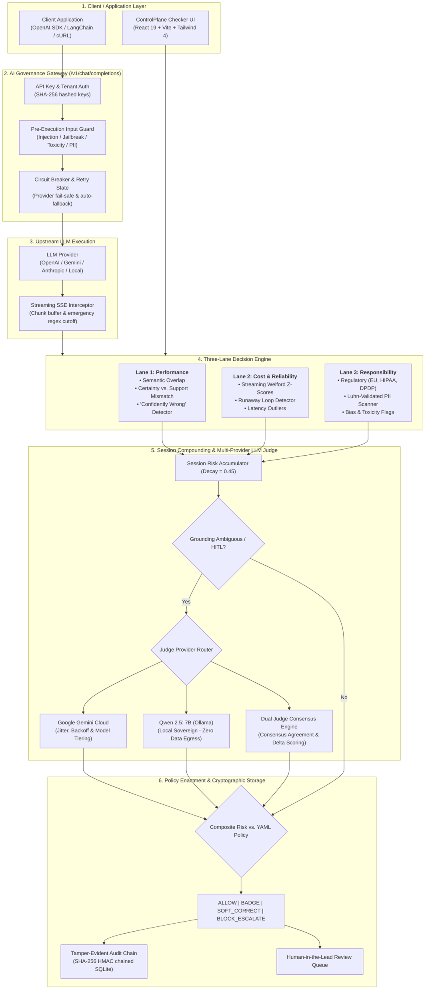

# ControlPlane Checker

ControlPlane Checker is an enterprise-grade AI trust, governance, and real-time observability control plane. It functions as both an inline reverse-proxy gateway (`/v1/chat/completions`) and sidecar inspection plane that intercepts prompts, retrieved context, and generated completions. The engine scores interactions across **Performance**, **Cost**, and **Responsibility** in real-time, enforcing granular policy tiers (`ALLOW`, `BADGE`, `SOFT_CORRECT`, `BLOCK_ESCALATE`) with a **Multi-Provider LLM Judge Engine** (Google Gemini Cloud, Local Sovereign Qwen 2.5: 7B via Ollama for zero data egress, and Dual Judge Consensus), streaming Server-Sent Events (SSE) token interception, cryptographic tamper-evident audit chaining, and GitOps YAML policy management.

[](https://opensource.org/licenses/Apache-2.0)
[](https://react.dev/)
[](https://www.typescriptlang.org/)
[](https://vitejs.dev/)
[](https://tailwindcss.com/)
[](https://expressjs.com/)
[](https://www.sqlite.org/)
[](https://www.docker.com/)
[](https://vitest.dev/)
[](https://ai.google.dev/)
[](https://ollama.com/)

For full source code and documentation, visit the [GitHub repository](https://github.com/lucifer-135/ControlPlane-Checker-Enterprise-AI-Trust-Governance).

Submit bug reports, feature suggestions, or track changes in the [issue queue](https://github.com/lucifer-135/ControlPlane-Checker-Enterprise-AI-Trust-Governance/issues).

## Table of contents

- [Overview and problem statement](#overview-and-problem-statement)
- [Requirements](#requirements)
- [Recommended tools](#recommended-tools)
- [Installation](#installation)
- [Configuration](#configuration)
- [Running the application](#running-the-application)
- [Docker deployment](#docker-deployment)
- [Automated test suite](#automated-test-suite)
- [Developer & demo-day utilities](#developer--demo-day-utilities)
- [Solution architecture](#solution-architecture)
- [The three governance lanes](#the-three-governance-lanes)
- [Multi-provider LLM judge engine](#multi-provider-llm-judge-engine)
- [AI governance gateway & stream interception](#ai-governance-gateway--stream-interception)
- [End-user delivery treatments & response shaping](#end-user-delivery-treatments--response-shaping)
- [Cryptographic audit chain & tamper verification](#cryptographic-audit-chain--tamper-verification)
- [GitOps YAML policy engine](#gitops-yaml-policy-engine)
- [Four-tier policy enactment](#four-tier-policy-enactment)
- [REST API reference](#rest-api-reference)
- [Key platform features](#key-platform-features)
- [Technology stack and dependencies](#technology-stack-and-dependencies)
- [Security and privacy posture](#security-and-privacy-posture)
- [Project directory layout](#project-directory-layout)
- [Troubleshooting](#troubleshooting)
- [FAQ](#faq)
- [Maintainers](#maintainers)
- [License](#license)

## Overview and problem statement

Enterprises deploying Generative AI models into mission-critical workflows face five catastrophic failure modes:

1. **Confidently Wrong Hallucinations**: Models asserting ungrounded claims with high linguistic conviction (e.g. inventing refund warranties, fabricating clinical guidelines, or promising SLA guarantees).
2. **Operational & Cost Outliers**: Runaway recursive tool calls, prompt loops, and token spikes exhausting inference infrastructure budgets.
3. **Regulatory & PII Leaks**: Silent leakage of Personally Identifiable Information (SSN, credit cards with Luhn checksum validation, patient data) violating EU AI Act, HIPAA, FINRA, or India DPDP Act.
4. **Session Drift**: Compounding risk across multi-turn sessions where isolated turns seem harmless but cumulative interactions breach policy boundaries.
5. **Adversarial Injections & Tampering**: Prompt injection, jailbreaking, and untracked triage decisions without verifiable audit trails.

**ControlPlane Checker** addresses these vulnerabilities with an inline proxy gateway and real-time observability control plane. It evaluates inputs via deterministic sub-millisecond heuristics, maintains cryptographic SHA-256 HMAC audit chains in SQLite, dynamically escalates borderline grounding to a **Multi-Provider LLM Judge** (Google Gemini Cloud, Local Sovereign Qwen 2.5: 7B via Ollama, or Dual Judge Consensus), and intercepts token streams in flight.

## Requirements

- **Node.js**: Version `20.0.0` or higher LTS recommended (`18.0.0+` supported)
- **Package Manager**: [npm](https://www.npmjs.com/) (bundled with Node.js) or [bun](https://bun.sh/)
- **C/C++ Build Tools**: Required for native `better-sqlite3` compilation (`make`, `g++`, or Visual Studio Build Tools on Windows)
- **Docker & Docker Compose** (Optional): For containerized deployments
- **Ollama** (Optional): For running the local sovereign LLM Judge (`qwen2.5:7b`) with zero external data egress

## Recommended tools

- **[Google AI Studio Gemini API Key](https://aistudio.google.com/app/apikey)**: Recommended for cloud LLM Judge arbitration. If omitted, the system operates seamlessly using local sovereign Ollama models or deterministic heuristics.
- **[Ollama](https://ollama.com/)**: Enables zero-egress local sovereign evaluation using open weights (`ollama run qwen2.5:7b`).
- **[Docker Desktop](https://www.docker.com/products/docker-desktop/)**: For single-command isolated container deployment.

## Installation

1. Clone the repository:

   ```bash
   git clone https://github.com/lucifer-135/ControlPlane-Checker-Enterprise-AI-Trust-Governance.git
   cd ControlPlane-Checker-Enterprise-AI-Trust-Governance
   ```

2. Install dependencies:
   ```bash
   npm install
   ```

## Configuration

1. Copy the environment configuration template:

   ```bash
   cp .env.example .env
   ```

2. Edit `.env` to configure your server parameters, LLM judge options, and API credentials:

   ```env
   # Google Gemini API key for cloud LLM Judge features (optional)
   GEMINI_API_KEY="your_gemini_api_key_here"

   # Primary production Gemini model
   GEMINI_MODEL="gemini-3.6-flash"

   # Local sovereign LLM Judge (Ollama - Zero Data Egress)
   OLLAMA_BASE_URL="http://localhost:11434"
   LOCAL_JUDGE_MODEL="qwen2.5:7b"
   OLLAMA_TIMEOUT_MS=120000

   # Server port (default: 3000)
   PORT=3000

   # Node environment ('development' | 'production')
   NODE_ENV=development

   # Base URL
   APP_URL="http://localhost:3000"

   # Authentication: 'dev' (default outside production) lets requests without an API
   # key act as a local-dev admin and binds to 127.0.0.1. 'required' demands a Bearer
   # API key on every route except /api/health. Production is always 'required'.
   CONTROLPLANE_AUTH_MODE=dev

   # First admin key for 'required' mode (at least 24 characters). The hard-coded demo
   # key cp_live_default_admin_key_2026 only works in 'dev' mode.
   CONTROLPLANE_BOOTSTRAP_ADMIN_KEY=""
   ```

3. **Policy Profiles**: Policies are stored as human-readable YAML documents in [`./policies/`](policies/) (`support-bot.yaml`, `decision-support.yaml`, `internal-copilot.yaml`). Modifications are hot-reloaded live without server restarts. Each `use_case` must be defined by exactly one file: the server refuses to start (and a hot reload keeps the previous profiles) if two files define the same `use_case`.

## Running the application

### Development mode

Starts the Express backend with hot-reloading policy watchers and Vite development server:

```bash
npm run dev
```

Open your browser at:

```
http://localhost:3000
```

### Production build & execution

1. Build the client bundle and compile the backend server bundle:

   ```bash
   npm run build
   ```

2. Start the production server:
   ```bash
   npm start
   ```

### Additional commands

- `npm run lint`: Static TypeScript type checking via `tsc --noEmit`.
- `npm run test`: Executes the complete Vitest test suite (**286 tests passing across 26 test files**).
- `npm run test:coverage`: Generates comprehensive test coverage reports with v8.
- `npm run bench`: Benchmarks decision engine and contradiction detector latency across 2k, 8k, and 32k token contexts (`scripts/bench-long-context.ts`).
- `npm run demo:reset`: Pre-demo verification script that safely archives SQLite data, validates/provisions `AUDIT_HMAC_SECRET`, and probes Ollama readiness (`scripts/demo-reset.ts`).
- `npm run demo:warm`: Pre-caches LLM judge evaluations across scenarios for lightning-fast presentation delivery (`scripts/demo-warm.ts`).
- `npm run format`: Formats codebase with Prettier.
- `npm run format:check`: Verifies code formatting compliance without modifying files.
- `npm run clean`: Cleans generated build artifacts in `dist/`.

## Docker deployment

ControlPlane Checker includes a multi-stage `Dockerfile` and `docker-compose.yml` for isolated enterprise deployment with persistent storage.

### Using Docker Compose

```bash
# Build and start container in detached mode
docker compose up -d --build

# View container logs
docker compose logs -f

# Check container health status
docker compose ps
```

The container automatically mounts:

- `./data`: Stores the persistent SQLite database (`controlplane.db`, WAL, and SHM files).
- `./policies`: Live-mounted directory for GitOps YAML policy hot-reloading.

## Automated test suite

The platform includes a comprehensive, production-grade test suite covering the three governance lanes, cryptographic audit chains, forensic tamper detection, SQLite persistence, SSE stream interception, circuit breaking, input guards, Luhn checksum validation, gateway model fallbacks, delivery treatments, and multi-provider LLM judge consensus.

```bash
# Run unit and integration tests
npm run test
```

### Test coverage areas (286 Passing Tests across 26 Test Suites)

| Test Suite | File | Tests | Coverage |
| :--- | :--- | :---: | :--- |
| **Responsibility Lane** | `src/lib/lanes/responsibilityLane.test.ts` | 29 | SSN, email, phone, credit card, individual compensation detection, job title preservation, address exclusion, regulatory rulesets |
| **Decision Engine** | `src/lib/decisionEngine.test.ts` | 23 | Composite risk scoring, multi-lane overlaps, session decay, hard safety overrides |
| **Stream Interceptor** | `src/server/streamInterceptor.test.ts` | 21 | SSE token interception, holdback buffer, emergency mid-stream cutoff, PII redaction |
| **Forensic Tamper Detection** | `src/server/db/auditTamper.test.ts` | 17 | Chain tampering detection: payload mutation, deletion, reordering, re-signing prevention |
| **Integration (HTTP)** | `src/server/integration.test.ts` | 16 | Real Express app: auth, RBAC, tenant scoping, PII redaction, circuit breaker |
| **Gateway Wire Compatibility** | `src/server/gateway.compat.test.ts` | 15 | OpenAI SDK wire compatibility, streaming choices, tool calls, finish reasons |
| **Luhn Checksum & PII Format** | `src/lib/utils/luhn.test.ts` | 15 | Modulo-10 Luhn checksum validation, structured SSN validation, false-positive suppression |
| **Input Guard** | `src/server/inputGuard.test.ts` | 13 | Jailbreaks, prompt injection, authority impersonation, system override attempts, PII scanning |
| **Database Adapter** | `src/server/db/database.test.ts` | 11 | Append-only decisions/audit, tenant scoping, API keys, roles, and session persistence |
| **Delivery Treatment** | `src/lib/deliveryTreatment.test.ts` | 11 | End-user delivery treatments, withheld responses, disclaimers, verification notes |
| **Gemini Cloud Judge** | `src/server/judge.gemini.test.ts` | 11 | Google Gemini backoff, jitter, model tier cycling, and structured schema enforcement |
| **Contradiction Detector** | `src/lib/utils/contradictionDetector.test.ts` | 11 | Monetary amount mismatches, absolute entitlement denials, negation flips, antonyms |
| **Findings Summarizer** | `src/lib/findings.test.ts` | 10 | Human-readable finding summaries and triggering claim span extraction |
| **Multi-Provider LLM Judge** | `src/server/judge.test.ts` | 9 | Gemini, Local sovereign Qwen, dual consensus agreement, and delta scoring |
| **Performance Lane** | `src/lib/lanes/performanceLane.test.ts` | 9 | Grounding evaluation, certainty bounds, confidently wrong detection, hallucination cutoffs |
| **Cost Lane (Welford)** | `src/lib/lanes/costLane.test.ts` | 9 | Dynamic Welford baselines, runaway loop detection, Z-score cutoff scaling |
| **Long-Context Evaluation** | `src/lib/longContext.test.ts` | 8 | Grounding and contradiction detection on 2k, 8k, and 32k token contexts |
| **Circuit Breaker** | `src/server/circuitBreaker.test.ts` | 8 | Upstream provider fault tolerance, state transitions, bounded half-open probe |
| **Gateway Proxy** | `src/server/gateway.test.ts` | 8 | Model fallback, 503 backoff, PII redact/block, input guard pre-execution |
| **Rolling Baselines** | `src/server/rollingBaseline.test.ts` | 7 | Online streaming Welford stats, validation, winsorization, versioned snapshots |
| **Policy Loader** | `src/server/policyLoader.test.ts` | 6 | GitOps YAML parsing, duplicate use_case rejection, live write-back, round-trip |
| **Gateway Grounding** | `src/server/gateway.grounding.test.ts` | 5 | End-to-end gateway grounding enforcement, ungrounded refund blocking |
| **Gateway Events** | `src/server/gatewayEvents.test.ts` | 5 | PII event payload sanitization, tenant filters, sequence epochs, SSE backpressure |
| **Audit Chain** | `src/server/db/auditChain.test.ts` | 4 | SHA-256 HMAC cryptographic audit chaining & mathematical integrity verification |
| **Gateway Disclaimers** | `src/server/gateway.disclaimer.test.ts` | 3 | Dynamic disclaimer and verification note injection on deliveries |
| **Dev Watcher** | `src/server/devWatch.test.ts` | 2 | HMR watcher ignores runtime database state while keeping source data live |

Tests run against an in-memory SQLite database (`vitest.setup.ts` sets `CONTROLPLANE_DB_PATH=:memory:`) and temporary policy directories, ensuring they never modify `data/` or `policies/`.

## Developer & demo-day utilities

ControlPlane Checker ships with production tools in `scripts/` to ensure predictable benchmarks and flawless live demonstrations:

- **Long-Context Benchmark (`npm run bench`)**:
  Simulates enterprise RAG workloads with retrieved context scaling from 2,000 to 32,000 tokens. Measures sub-linear evaluation latency to ensure zero quadratic bottlenecks during lexical grounding and contradiction detection.
- **Pre-Demo Reset (`npm run demo:reset`)**:
  Ensures clean presentation states:
  1. Checks that the active server is stopped to prevent SQLite locks.
  2. Ensures `AUDIT_HMAC_SECRET` is set in `.env` (generating a secure random secret if absent).
  3. Safely archives existing databases to `data/archive/<timestamp>/` rather than destructive deletion.
  4. Probes local Ollama connectivity and model residency (`qwen2.5:7b`).
  5. Optionally restores baseline policy profiles from Git (`npm run demo:reset -- --restore-policies`).
- **Judge Cache Pre-Warmer (`npm run demo:warm`)**:
  Pre-populates LLM judge evaluation records in SQLite for all 19 synthetic interactions, enabling instant response times and offline reliability during air-gapped demo sessions.

## Solution architecture


```mermaid
flowchart TD
    subgraph ClientLayer["1. Client / Application Layer"]
        ClientApp["Client Application\n(OpenAI SDK / LangChain / cURL)"]
        BrowserUI["ControlPlane Checker UI\n(React 19 + Vite + Tailwind 4)"]
    end

    subgraph GatewayLayer["2. AI Governance Gateway (/v1/chat/completions)"]
        AuthCheck["API Key & Tenant Auth\n(SHA-256 hashed keys)"]
        InputGuard["Pre-Execution Input Guard\n(Injection / Jailbreak / Toxicity / PII)"]
        CircuitBreaker["Circuit Breaker & Retry State\n(Provider fail-safe & auto-fallback)"]
    end

    subgraph UpstreamLLM["3. Upstream LLM Execution"]
        LLMProvider["LLM Provider\n(OpenAI / Gemini / Anthropic / Local)"]
        StreamEngine["Streaming SSE Interceptor\n(Chunk buffer & emergency regex cutoff)"]
    end

    subgraph GovernanceEngine["4. Three-Lane Decision Engine"]
        direction LR
        L1["<b>Lane 1: Performance</b><br/>• Semantic Overlap<br/>• Certainty vs. Support Mismatch<br/>• 'Confidently Wrong' Detector"]
        L2["<b>Lane 2: Cost & Reliability</b><br/>• Streaming Welford Z-Scores<br/>• Runaway Loop Detector<br/>• Latency Outliers"]
        L3["<b>Lane 3: Responsibility</b><br/>• Regulatory (EU, HIPAA, DPDP)<br/>• Luhn-Validated PII Scanner<br/>• Bias & Toxicity Flags"]
    end

    subgraph Arbiter["5. Session Compounding & Multi-Provider LLM Judge"]
        Accumulator["Session Risk Accumulator (Decay = 0.45)"]
        JudgeTrigger{"Grounding Ambiguous / HITL?"}
        JudgeRouter{"Judge Provider Router"}
        GeminiFlash["Google Gemini Cloud\n(Jitter, Backoff & Model Tiering)"]
        LocalQwen["Qwen 2.5: 7B (Ollama)\n(Local Sovereign - Zero Data Egress)"]
        DualConsensus["Dual Judge Consensus Engine\n(Consensus Agreement & Delta Scoring)"]
    end

    subgraph EnactmentStorage["6. Policy Enactment & Cryptographic Storage"]
        PolicyRouter{"Composite Risk vs. YAML Policy"}
        Tiers["ALLOW | BADGE | SOFT_CORRECT | BLOCK_ESCALATE"]
        AuditChain["Tamper-Evident Audit Chain\n(SHA-256 HMAC chained SQLite)"]
        ReviewQueue["Human-in-the-Lead Review Queue"]
    end

    ClientApp --> AuthCheck
    AuthCheck --> InputGuard
    InputGuard --> CircuitBreaker
    CircuitBreaker --> LLMProvider
    LLMProvider --> StreamEngine
    StreamEngine --> GovernanceEngine

    BrowserUI --> GovernanceEngine
    L1 --> Accumulator
    L2 --> Accumulator
    L3 --> Accumulator
    Accumulator --> JudgeTrigger
    JudgeTrigger -- Yes --> JudgeRouter
    JudgeRouter --> GeminiFlash
    JudgeRouter --> LocalQwen
    JudgeRouter --> DualConsensus
    GeminiFlash --> PolicyRouter
    LocalQwen --> PolicyRouter
    DualConsensus --> PolicyRouter
    JudgeTrigger -- No --> PolicyRouter

    PolicyRouter --> Tiers
    Tiers --> AuditChain
    Tiers --> ReviewQueue
```

## The three governance lanes

### 1. Performance & Groundedness Lane

- **N-Gram & Jaccard Grounding**: Computes token-level and phrase-level overlap against retrieved RAG documents.
- **Lexical & Semantic Contradiction Detection**:
  - **Antonym Contradictions**: Detects conflicting states (refundable vs. non-refundable, approved vs. denied, active vs. terminated).
  - **Negation Flips**: Catches phrase inversions within sentence and chunk boundaries.
  - **Monetary Discrepancy Matching**: Exact numerical money comparison without rounding tolerance to catch fabricated fees, pricing, or refund amounts (the "one dollar" check, e.g. quoting "$24" instead of policy "$25").
  - **Absolute Entitlement Denials**: Flags assertive denials of benefits or legal rights ("you will never qualify under any law") when reference policies specify valid entitlement conditions.
- **Certainty vs. Support Mismatch ("Confidently Wrong")**: Identifies high linguistic assertiveness (_"guaranteed"_, _"without question"_, _"strictly mandates"_) combined with low grounding scores ($\le 0.35$), surfacing the most catastrophic hallucination modes.
- **Long-Context RAG Robustness**: Validated and benchmarked across retrieved contexts from 2,000 to 32,000 tokens with linear, sub-millisecond evaluation overhead.
- **Multi-Provider LLM Judge Arbitration**: Automatically hands off ambiguous cases (grounding scores between 0.35–0.60) or on-demand triage to Gemini Cloud, local sovereign Qwen, or dual consensus.

### 2. Cost & Operational Reliability Lane

- **Streaming Welford Algorithm**: Continuously updates running mean ($\mu$) and standard deviation ($\sigma$) per use-case and query workload in constant time ($O(1)$) without historic vector memory.
- **Z-Score Outlier Flagging**: Intercepts token bloat ($Z_{tokens} > 2.5$) and latency spikes ($Z_{latency} > 3.0$).
- **Runaway Loop Detection**: Flags recursive agentic patterns where completion tokens or tool invocations exceed safety envelopes.
- **Winsorization & Snapshot Persistence**: Protects rolling distributions against extreme anomalies and persists baseline state to SQLite.

### 3. Responsibility, PII & Regulatory Compliance Lane

- **Modulo-10 Luhn Algorithm Validation**: Validates candidate credit card numbers mathematically with Luhn checksum validation, completely eliminating false positives from numeric product IDs or invoice codes.
- **Structured SSN & National ID Syntax**: Formatted Social Security Number verification with strict area/group/serial checks (rejecting 000, 666, and 900–999 area ranges).
- **Context-Aware PII Confidence Boosting**: Multi-token window analysis detecting surrounding risk keywords (e.g. tax, routing, DOB, password, billing).
- **Individual Compensation Detection (`findCompensationAmounts`)**: Specifically detects salary, bonus, wages, and base pay figures associated with individuals (`"salary of $345,000"`, `"$92k per year"`), while cleanly separating personal disclosures from general policy caps (`"up to $1,500 per week"`).
- **Sensitive Name Disclosures**: Context-aware proper name detection that excludes street names inside addresses and preserves professional prefixes and job titles (`"Director [REDACTED_NAME]"`).
- **Jurisdiction-Specific Frameworks**:
  - **EU AI Act Standard**: Mandatory high-risk transparency tagging and PII redaction.
  - **US HIPAA & FINRA**: Patient health identifier detection and financial advice warnings.
  - **India DPDP Act**: Digital personal data protection, Aadhaar masking.
- **Hard Governance Overrides**: Critical violations (exposed SSN, active credit card, hate speech, compensation leaks) trigger immediate `BLOCK_ESCALATE` regardless of other lane scores.

## Multi-provider LLM judge engine

ControlPlane Checker features an advanced, multi-tier LLM Judge architecture providing flexible arbitration across cloud, sovereign on-premise, and dual-consensus topologies:

### 1. Google Gemini Cloud Judge

- **Stable Model Tiering**: Automatically cycles through production models (`gemini-flash-lite-latest`, `gemini-3.5-flash-lite`, `gemini-3.8-flash`, `gemini-3.6-flash`, `gemini-flash-latest`) without experimental preview throttling.
- **Exponential Backoff with Randomized Jitter**: Mitigates 429 rate limits and 503 capacity spikes (`delay = min(base * 2^attempt, max) + jitter`).
- **Structured Schema Enforcement**: Forces JSON response schemas for groundedness, certainty, and specific triggering span extraction.

### 2. Local Sovereign LLM Judge (Qwen 2.5: 7B via Ollama)

- **Zero Data Egress**: Fully on-premises execution via local Ollama instance (`http://localhost:11434`) for classified, air-gapped, or regulated environments.
- **VRAM Cold-Start Handling**: Configured with extended timeout (`OLLAMA_TIMEOUT_MS=120000`) and 30-minute VRAM residency (`keep_alive: '30m'`).
- **Automatic Health & Model Probing**: `/api/health` probes local Ollama status, reachability, and installed model tags.

### 3. Dual Judge Consensus Engine

- **Parallel Adjudication**: Executes both Gemini Cloud and Local Qwen simultaneously.
- **Consensus & Discrepancy Detection**: Compares verdicts (`AGREED` vs `DISAGREED`) and computes mathematical score deltas:
   - Δ<sub>groundedness</sub> = |Score<sub>Gemini</sub> − Score<sub>Qwen</sub>|
   - Δ<sub>certainty</sub> = |Score<sub>Gemini</sub> − Score<sub>Qwen</sub>|
   - Δ<sub>mismatch</sub> = |Score<sub>Gemini</sub> − Score<sub>Qwen</sub>|
- **Conservative Safety Override**: If models disagree on verdict, the platform automatically enacts the more protective risk tier (`CONFIDENTLY_WRONG` > `UNSUPPORTED` > `AMBIGUOUS` > `SUPPORTED`).
- **Triggering Span Union**: Merges extracted problematic claim spans across both models.

### 4. Deterministic Autonomous Fallback

- If neither cloud nor local LLM endpoints are reachable, the engine uses local semantic n-gram overlap, lexical contradiction detection, and certainty bounds heuristics to return complete verdicts without failing requests.

## AI governance gateway & stream interception

ControlPlane Checker provides an OpenAI-compatible reverse-proxy endpoint at `/v1/chat/completions`:

- **Drop-in Client Compatibility**: Works out of the box with standard `openai-python`, `openai-node`, LangChain, and LlamaIndex configurations.
- **Pre-Execution Input Guard**: Analyzes prompts before reaching the model to block prompt injections, jailbreaks, authority impersonations, and sensitive data uploads.
- **Real-Time Streaming SSE Interceptor**: Inspects Server-Sent Events token streams chunk-by-chunk using a rolling holdback window. If a hard violation appears mid-stream (such as an unmasked Social Security Number or credit card), the proxy immediately cuts the stream, appends an emergency governance disclaimer, and logs the incident.
- **Multi-Model Upstream Fallback**: Automatically tries candidate models with exponential backoff on 503/429 upstream errors.
- **Governance Headers**: Injects telemetry headers into every response:
  - `X-ControlPlane-Verdict`: Active policy enactment (`ALLOW`, `BADGE`, `SOFT_CORRECT`, `BLOCK_ESCALATE`).
  - `X-ControlPlane-Risk-Score`: Normalized composite risk (0.00 - 1.00).
  - `X-ControlPlane-Session-Risk`: Compounded multi-turn risk.
  - `X-ControlPlane-Policy-Version`: Active GitOps YAML policy version.
  - `X-ControlPlane-Latency-Ms`: Added governance overhead.

## End-user delivery treatments & response shaping

ControlPlane Checker distinguishes between internal policy verdicts and the concrete delivery treatment presented to the end user:

```
                            ┌───────────────────────────────────────────────┐
                            │               Upstream Response               │
                            └───────────────────────┬───────────────────────┘
                                                    │
                                          PII Redaction Applied
                                     (Surgically redacts sensitive
                                     spans in text and tool calls)
                                                    │
                                                    ▼
                             ┌─────────────────────────────────────────────┐
                             │          Pre-Response Blocking On?          │
                             └──────────────┬───────────────┬──────────────┘
                                      Yes   │               │   No
                                            ▼               ▼
                             ┌─────────────────────┐ ┌─────────────────────┐
                             │  WITHHELD_RESPONSE  │ │  Delivered with     │
                             │  (Refusal sent with │ │  Delivery Note:     │
                             │  content_filter)    │ │  • Accuracy Warning │
                             └─────────────────────┘ │  • Verification Note│
                                                     └─────────────────────┘
```

### Exact client treatment per verdict

1. **`ALLOW` (Clean Delivery)**:
   The upstream model response is delivered to the user unchanged.
2. **`BADGE` (Delivered with Verification Note)**:
   The response is delivered with an automated notice informing the user that certain details could not be fully verified against internal records:
   ```
   ---
   ℹ️ Automated check: some details in this answer could not be fully verified against our records. Please confirm important figures before relying on them.
   ```
3. **`SOFT_CORRECT` (Delivered with Accuracy Warning)**:
   The response is delivered with a prominent warning urging independent verification:
   ```
   ---
   ⚠️ This response has been flagged for potential accuracy concerns. Please verify the information independently before acting on it.
   ```
4. **`BLOCK_ESCALATE` (Pre-Response Blocking Enabled)**:
   The ungrounded or violating response is completely withheld from the user and replaced with a standard safe refusal:
   ```
   I'm unable to provide this response as it has been flagged by our governance system. A human reviewer has been notified.
   ```
   The gateway sets `finish_reason: 'content_filter'` in OpenAI-compatible JSON responses.
5. **`BLOCK_ESCALATE` (Post-Delivery Review Mode)**:
   When `pre_response_blocking` is disabled, the response is delivered to the user with all PII redacted and the accuracy disclaimer appended, while simultaneously routing to the Human-in-the-Loop review queue as a post-delivery audit item.
6. **Surgical PII Redaction**:
   Detected PII entities are replaced in-place with standardized placeholders (`[REDACTED_SSN]`, `[REDACTED_CARD]`, `[REDACTED_COMPENSATION]`, `[REDACTED_NAME]`, `[REDACTED_ADDRESS]`) across both free text content and JSON arguments in structured tool/function calls without invalidating syntax.
7. **"What the user sees" UI Inspection**:
   Both the **Live Telemetry Stream** and the **Human Review Queue** embed a dedicated User-Visible Response Panel with real-time status indicators (`Withheld`, `Delivered with changes`, `Delivered unchanged`) and formatted redaction chips.

## Cryptographic audit chain & tamper verification

Every evaluation is recorded into a persistent SQLite database (`better-sqlite3` in WAL mode) with an immutable cryptographic HMAC-SHA256 chain:

1. **Hash Chaining**: Each record computes its SHA-256 signature by hashing its payload together with the `current_hash` of the preceding record: $`\text{Hash}_n = \text{HMAC-SHA256}(\text{Record}_n \mathbin{\Vert} \text{Hash}_{n-1}, \text{Secret})`$
2. **Tamper Detection**: If any row is modified, deleted, or inserted out of sequence in the database file, the hash chain breaks.
3. **Verification API**: Call `GET /api/audit-logs/verify` to verify the mathematical integrity of all audit records. The endpoint returns `INTEGRITY_VERIFIED` or pinpointed details on any detected tampering.

## GitOps YAML policy engine

Policies are stored as declarative, human-readable YAML documents in [`./policies/`](policies/) and watched at runtime:

```yaml
# ControlPlane Checker Policy Profile: policies/support-bot.yaml
version: "2.4.1-rc"
use_case: "support_bot"
name: "Customer Support Bot Profile"
description: "High-throughput, customer-facing tier. Strict against toxic language and PII disclosures with low added latency."
geography_ruleset: "EU_AI_ACT_STANDARD"

runtime_governance:
  latency_budget_ms: 180
  pre_response_blocking: true
  fail_mode: "FAIL_OPEN"
  timeout_fallback: "UNKNOWN_FLAG"

active_lanes:
  performance: true
  cost: true
  responsibility: true

lane_weights:
  performance: 0.40
  cost: 0.30
  responsibility: 0.30

verdict_tier_thresholds:
  block_escalate: 0.70
  soft_correct: 0.45
  badge: 0.25

lane_cutoffs:
  cost_z_score_cutoff: 2.0
  pii_severity_cutoff: 0.30
  hallucination_cutoff: 0.40
  toxicity_cutoff: 0.40
```

- **Live Hot-Reload**: Editing a YAML policy file updates server enforcement in memory within milliseconds without server restarts.
- **Strict Uniqueness**: Exactly one YAML file defines each `use_case`. Conflicting duplicate definitions are rejected at startup and hot reload.
- **Version Tracking**: Policy changes are tracked with semantic versioning tags for GitOps audit compliance.

## Four-tier policy enactment

| Tier | Condition / Threshold | User Delivery Treatment | Latency Overhead |
| :--- | :-------------------- | :---------------------- | :--------------- |
| **`ALLOW`** | Composite Risk $< \theta_{badge}$ | Delivered unchanged; detailed audit telemetry persisted. | $\approx 0\text{ ms}$ |
| **`BADGE`** | $\theta_{badge} \le \text{Risk} < \theta_{soft}$ | Delivered with automated verification note appended. | $+35\text{ ms}$ |
| **`SOFT_CORRECT`** | $\theta_{soft} \le \text{Risk} < \theta_{block}$ | Delivered with accuracy disclaimer appended and PII redacted. | $+45\text{ ms}$ |
| **`BLOCK_ESCALATE`** | $\text{Risk} \ge \theta_{block}$ OR Critical Violation | **Pre-response blocked**: replaced with withheld refusal message.<br/>**Non-blocking**: delivered with disclaimer and routed to HITL queue. | $+140\text{ ms}$ (pre-block) |

## REST API reference

Every route except `/api/health` requires `Authorization: Bearer <api key>` (in `dev` auth mode a missing header acts as a local-dev admin). API keys carry a role, from lowest to highest privilege: `service` < `viewer` < `reviewer` < `admin`. Reads are scoped to the caller's tenant. Admins see their whole org, and other roles see only their own workspace.

| Endpoint                     | Method | Min. role  | Description                                                                          |
| :--------------------------- | :----: | :--------: | :----------------------------------------------------------------------------------- |
| `/v1/chat/completions`       | `POST` | `service`  | OpenAI-compatible reverse proxy with per-provider model fallback & SSE interception  |
| `/api/evaluate`              | `POST` | `service`  | Evaluates one interaction; writes an audit record only with `persist: true`          |
| `/api/evaluate/batch`        | `POST` | `service`  | Simulates a dataset against policy profiles; no audit writes unless `persist: true`  |
| `/api/judge`                 | `POST` | `service`  | LLM Judge arbitration: Gemini, Local Sovereign Qwen, or Dual Consensus               |
| `/api/input-guard`           | `POST` |  `viewer`  | Pre-execution scan for prompt injections, jailbreaks, and PII leaks                  |
| `/api/policies`              | `GET`  |  `viewer`  | Retrieves all active YAML policy profiles                                            |
| `/api/baselines`             | `GET`  |  `viewer`  | Retrieves current Welford empirical distributions ($\mu, \sigma$)                    |
| `/api/audit-logs`            | `GET`  |  `viewer`  | Paginated audit trail records for the caller's tenant                                |
| `/api/review-decisions`      | `GET`  |  `viewer`  | Persisted Human-in-the-Lead review decisions for the caller's tenant                 |
| `/api/gateway/events`        | `GET`  |  `viewer`  | Poll recent (PII-redacted) gateway events; pass back `after` + `epoch` as the cursor |
| `/api/gateway/events/stream` | `GET`  |  `viewer`  | Same events as Server-Sent Events                                                    |
| `/api/gateway/escalations`   | `GET`  |  `viewer`  | Persisted `BLOCK_ESCALATE` gateway events that have no review decision yet           |
| `/api/metrics`               | `GET`  |  `viewer`  | Exports Prometheus metrics text format                                               |
| `/api/review-decisions`      | `POST` | `reviewer` | Appends an HITL decision (immutable; `409` on a duplicate ID)                        |
| `/api/policies/:useCase`     | `PUT`  |  `admin`   | Updates a policy profile and persists it to its YAML file                            |
| `/api/policies/reset`        | `POST` |  `admin`   | Resets policy profiles and YAML files to defaults                                    |
| `/api/baselines/observe`     | `POST` |  `admin`   | Manually feeds a validated token/latency observation into the Welford accumulator    |
| `/api/baselines/reset`       | `POST` |  `admin`   | Resets rolling baselines to their seeded defaults                                    |
| `/api/rate-limit/simulate`   | `POST` |  `admin`   | Simulates request bursts against the caller's own rate-limit window                  |
| `/api/rate-limit/reset`      | `POST` |  `admin`   | Resets the caller's rate-limit window                                                |
| `/api/audit-logs/verify`     | `GET`  |  `admin`   | Verifies cryptographic HMAC-SHA256 chain integrity                                   |
| `/api/keys`                  | `POST` |  `admin`   | Generates an API key (with a `role`) within the admin's own org                      |
| `/api/health`                | `GET`  |   public   | Health check, auth mode, Gemini key readiness, and Local Ollama status & models      |

Review decisions and audit records are **append-only**: SQLite triggers reject `UPDATE`/`DELETE`, so a correction is recorded as a new decision for the same interaction (the latest one is effective).

## Key platform features

### 1. Executive Telemetry Dashboard

- High-level KPIs: Total Audited Volume, Block Rate, Confidently Wrong Hallucination Rate, PII Leaks Blocked, and Average Governance Overhead.
- Interactive multi-dimensional charts: Risk Distribution by Lane (Recharts), Hourly Volume vs. Blocks, and Cross-Use-Case Governance Matrix.
- Quick Triage widget displaying the latest high-risk escalations with instant review actions.

### 2. Live Telemetry Stream

- Real-time simulation of incoming enterprise AI interactions across Customer Support, Internal Copilots, and Decision Support agents.
- Playback controls: Play/Pause, Step forward 1 interaction, 1x/2x/5x speed selectors, and instant stream rendering.
- Telemetry inspection view with token breakdown, latency gauges, triggering span highlights, and 1-click **Multi-Provider LLM Judge** execution.
- **"What the user sees" Response Panel**: Real-time rendering of the exact client-facing response, highlighting surgical redaction placeholders (`[REDACTED_SSN]`, `[REDACTED_COMPENSATION]`, etc.) and appended verification notes or disclaimers.

### 3. Frontline Human Review Queue

- Human-in-the-Lead (HITL) adjudication portal for blocked or escalated interactions.
- Side-by-side prompt, retrieved context, and model output view with colored span highlights.
- Clear distinction between **Withheld** interactions (pre-response blocked) and **Delivered · Post-Delivery Review** items (allowed to user with disclaimers/redactions, queued for compliance audit).
- Dedicated User-Visible Response Panel showing what the user received versus the unredacted upstream output.
- 1-click arbitration actions: **Approve & Release**, **Overturn & Correct**, **Escalate to Legal/Security**, or **Trigger Gemini / Qwen / Dual Judge**.
- Adjudications are persisted directly to SQLite with automated session audit logging.
- **Append-Only Decision Trail**: Recorded decisions cannot be edited or deleted (enforced by SQLite triggers). Each decision is attributed to the authenticated API key that made it, and a correction is recorded as a new decision.

### 4. Interactive Sandbox Lab

- Live testing harness to input custom prompts, retrieved contexts, and candidate responses.
- Evaluates inputs in real-time across all three lanes.
- On-demand **Multi-Provider Judge**: switch between Google Gemini Cloud, Local Sovereign Qwen 2.5: 7B via Ollama, or Dual Judge Consensus.
- Real-time Ollama status indicator with model detection and connectivity alerts.

### 5. Policy Studio

- Tailor governance parameters per use-case (`support_bot`, `internal_copilot`, `decision_support`).
- Configure lane weights (Performance vs. Cost vs. Responsibility), trigger thresholds, and regulatory regimes (EU AI Act, HIPAA/FINRA, DPDP).
- Real-time synchronization with server-side YAML policies.

### 6. Trust Metrics & Tradeoff Dial

- Interactive Confusion Matrix calculating True Positives, False Positives, True Negatives, and False Negatives against labeled ground truth.
- Precision-Recall Curve and False Positive Rate (FPR) vs. Block Rate trade-off slider.
- Real-time SLA impact estimation and false escalation cost projections.

## Technology stack and dependencies

| Component              | Technology                                                                     | Purpose                                                       |
| :--------------------- | :----------------------------------------------------------------------------- | :------------------------------------------------------------ |
| **Frontend Framework** | [React 19](https://react.dev/) + [TypeScript](https://www.typescriptlang.org/) | Type-safe UI state management and component lifecycle         |
| **Build Tooling**      | [Vite 6](https://vitejs.dev/)                                                  | Sub-millisecond HMR and optimized production bundling         |
| **Styling**            | [Tailwind CSS 4](https://tailwindcss.com/)                                     | Modern design system, frosted glassmorphism, fluid layouts    |
| **Data Visualization** | [Recharts 3](https://recharts.org/)                                            | Responsive telemetry and governance metric charts             |
| **Icons & Visuals**    | [Lucide React](https://lucide.dev/)                                            | Modern visual iconography                                     |
| **Database Engine**    | [better-sqlite3](https://github.com/WiseLibs/better-sqlite3)                   | High-throughput embedded SQLite database in WAL mode          |
| **Policy Parser**      | [js-yaml](https://github.com/nodeca/js-yaml)                                   | YAML policy file parsing and schema validation                |
| **Backend Server**     | [Express](https://expressjs.com/) (Node.js)                                    | REST API, SSE streaming proxy, and static file serving        |
| **Cloud LLM Judge**    | [@google/genai](https://www.npmjs.com/package/@google/genai)                   | Server-side integration with Gemini 3.6 / 3.8 Flash models    |
| **Local LLM Judge**    | [Ollama](https://ollama.com/) (Qwen 2.5: 7B)                                   | Zero-egress sovereign on-premises evaluation                  |
| **Server Bundler**     | [esbuild](https://esbuild.github.io/)                                          | Fast bundling of backend TypeScript into `dist/server.cjs`    |
| **Test Runner**        | [Vitest 3](https://vitest.dev/)                                                | Unit testing and v8 coverage analysis (286 tests passing across 26 test suites) |
| **Containerization**   | [Docker](https://www.docker.com/)                                              | Multi-stage production container with health checks           |

## Security and privacy posture

- **Zero Client-Side Key Exposure**: The `GEMINI_API_KEY` is strictly accessed on the server. No credentials or keys are bundled or transmitted to the client.
- **Authenticated, Role-Based API**: In production every route except `/api/health` requires an API key; keys carry `service`/`viewer`/`reviewer`/`admin` roles. Unauthenticated access exists only in the explicit local-dev auth mode, which binds to loopback by default. The hard-coded demo key is disabled outside dev mode.
- **Tenant Isolation & Payload Minimization**: Audit logs, review decisions, gateway events, and escalations are stamped with and filtered by org/workspace. Gateway events are PII-redacted and truncated before buffering (`CONTROLPLANE_EVENT_PAYLOADS=redacted|none`), expire after a TTL, and slow SSE consumers are disconnected.
- **Zero-Egress Sovereign LLM Option**: Support for local Ollama instances ensures completely sovereign evaluation without any data leaving private network boundaries.
- **Fail-Safe Heuristic Simulation**: In air-gapped environments or scenarios where external LLMs are unavailable, the platform gracefully switches to deterministic semantic and statistical heuristics without failing requests.
- **Cryptographic Audit Trail**: Immutable SHA-256 HMAC hash chaining ensures all evaluation records and HITL triage decisions are tamper-evident.
- **Luhn Algorithm Validation**: Credit card scanning uses algorithmic checksum verification, preventing false-positive customer ID matches while ensuring real financial leaks are caught.
- **Pre-Flight Input Guard**: Proactively intercepts injection attacks, jailbreaks, and sensitive data prior to model invocation.
- **Streaming Token Interception**: SSE token streams are inspected chunk-by-chunk with immediate stream termination if PII or credentials appear.
- **Strict Environment Isolation**: All `.env*` files are excluded from version control via `.gitignore`.
- **Zero Known Vulnerabilities**: Verified clean with `npm audit` (0 vulnerabilities).

## Project directory layout

```
ControlPlane-Checker/
├── .env.example              # Sanitized environment template
├── .gitignore                # Comprehensive Git exclusion rules
├── .dockerignore             # Docker build exclusion rules
├── Dockerfile                # Multi-stage production Docker build
├── docker-compose.yml        # Docker Compose configuration with volume mounts
├── index.html                # HTML entrypoint & typography configuration
├── package.json              # Dependencies, build scripts & metadata
├── tsconfig.json             # TypeScript compiler settings
├── vite.config.ts            # Vite & Tailwind CSS bundler configuration
├── server.ts                 # Express server, gateway proxy & API endpoints
├── scripts/                  # Benchmarking, demo initialization & cache warmers
│   ├── bench-long-context.ts # RAG context latency benchmarks (2k -> 32k tokens)
│   ├── demo-reset.ts         # Pre-demo DB archive, audit key & readiness checks
│   └── demo-warm.ts          # LLM judge evaluation cache pre-warmer
├── policies/                 # GitOps YAML Policy Profiles
│   ├── support-bot.yaml      # Support Bot policy configuration
│   ├── decision-support.yaml # Decision Support strict policy
│   └── internal-copilot.yaml # Internal Copilot balanced policy
├── data/                     # Persistent SQLite storage
│   └── controlplane.db       # Database file (WAL mode, auto-created)
├── src/
│   ├── main.tsx              # React DOM mounting
│   ├── App.tsx               # Main application controller & tab orchestration
│   ├── types.ts              # Domain types (Lanes, Tiers, Policies, Judge types)
│   ├── index.css             # Tailwind 4 theme & custom glassmorphism styles
│   ├── components/           # UI Components & Tabs
│   │   ├── AmbientShaderBackground.tsx # Hardware-accelerated CSS ambient mesh
│   │   ├── ApiKeyPrompt.tsx            # API key and role authentication modal
│   │   ├── DashboardTab.tsx            # Executive KPI & overview charts
│   │   ├── GeminiJudgeResultCard.tsx   # Multi-Judge & Dual consensus evaluation card
│   │   ├── GlassDropdown.tsx           # Accessible frosted glass dropdown component
│   │   ├── Header.tsx                  # Global navigation bar & tester trigger
│   │   ├── InteractionContextPanel.tsx # RAG context chunks, system prompt & history
│   │   ├── InteractionTesterModal.tsx  # Live interactive sandbox with Judge selector
│   │   ├── LiveFeedTab.tsx             # Real-time telemetry feed & stream
│   │   ├── PolicyProfilesTab.tsx       # Per-use-case policy threshold editor
│   │   ├── ReviewQueueTab.tsx          # Frontline HITL adjudication portal
│   │   ├── StatusNotice.tsx            # Server connection & policy status banners
│   │   ├── TrustMetricsTab.tsx         # Confusion matrix & calibration dial
│   │   ├── UserVisibleResponse.tsx     # "What the user sees" delivery preview panel
│   │   ├── VerdictBadge.tsx            # Visual tier badge component
│   │   └── WavyDots.tsx                # Visual indicator effects
│   ├── data/                 # Baseline & Synthetic Datasets
│   │   ├── baselines.ts                # Empirical normal distributions
│   │   ├── interactions.ts             # Multi-domain synthetic interaction dataset
│   │   └── longContextScenarios.ts     # Realistic multi-turn long RAG context scenarios
│   ├── lib/                  # Core Business Logic & Decision Engine
│   │   ├── apiClient.ts                # Authenticated client helper for API routes
│   │   ├── decisionEngine.ts           # 3-lane aggregator & session compounding
│   │   ├── deliveryTreatment.ts       # End-user delivery treatments, notes & disclaimers
│   │   ├── findings.ts                 # Human-readable claim finding summarizer
│   │   ├── inputGuard.ts               # Shared input guard & prompt injection rules
│   │   ├── metrics.ts                  # Confusion matrix & PR calculations
│   │   ├── policyProfiles.ts           # Fallback policy profile definitions
│   │   ├── rollingBaseline.ts          # Welford algorithm online streaming tracker
│   │   ├── lanes/                      # Individual Lane Evaluators
│   │   │   ├── costLane.ts             # Z-score outlier & runaway loop detector
│   │   │   ├── performanceLane.ts      # Grounding & Confidently Wrong detector
│   │   │   └── responsibilityLane.ts   # PII scanner, compensation & regulatory rulesets
│   │   └── utils/                      # Evaluation Utilities
│   │       ├── contradictionDetector.ts# Lexical contradiction & monetary matcher
│   │       ├── entityExtractor.ts      # Entity & keyword extractor
│   │       ├── luhn.ts                 # Modulo-10 Luhn checksum validator
│   │       ├── ngramOverlap.ts         # N-gram context overlap scorer
│   │       └── piiContext.ts           # PII regex patterns & context analyzer
│   └── server/               # Enterprise Server Modules
│       ├── app.ts                      # Express application & REST API router
│       ├── auth.ts                     # API key authentication & rate limiting
│       ├── baselinePersistence.ts      # SQLite persistence for Welford distributions
│       ├── circuitBreaker.ts           # Fault-tolerant provider circuit breaker
│       ├── config.ts                   # Environment configuration loader
│       ├── devWatch.ts                 # Selective HMR watcher configuration
│       ├── gateway.ts                  # OpenAI-compatible chat completions proxy
│       ├── gatewayEvents.ts            # PII-redacted event buffer & SSE dispatcher
│       ├── inputGuard.ts               # Server wrapper for input guard scanning
│       ├── judge.ts                    # Multi-provider LLM Judge (Gemini, Qwen, Dual)
│       ├── policyLoader.ts             # YAML policy loader & directory watcher
│       ├── rollingBaseline.ts          # Welford dynamic streaming baseline
│       ├── streamInterceptor.ts        # SSE chunk interceptor & emergency cutter
│       ├── telemetry.ts                # Prometheus metrics formatting
│       └── db/                         # Database Layer
│           ├── auditChain.ts           # SHA-256 HMAC audit chaining & verification
│           ├── database.ts             # SQLite adapter (better-sqlite3)
│           └── schema.ts               # Database DDL schema, migrations & append-only triggers
└── dist/                     # Production build output (generated)
```

## Troubleshooting

- **Missing Gemini API Key (`GEMINI_API_KEY`)**:
  - If no Gemini key is provided, the platform automatically utilizes local Ollama models (if available) or deterministic heuristics. Real-time governance will continue to operate without external network calls.
  - To enable Gemini Cloud Judge features, generate a key at [Google AI Studio](https://aistudio.google.com/app/apikey) and set `GEMINI_API_KEY` in `.env`.
- **Using Local Ollama Judge (`qwen2.5:7b`)**:
  - Ensure Ollama is installed and running (`ollama serve`).
  - Pull the model: `ollama pull qwen2.5:7b`.
  - The UI will automatically detect when Ollama is online.
- **Port 3000 already in use**:
  - Update `PORT=3001` (or another available port) in `.env` and restart the server.
- **Native module compilation (`better-sqlite3`)**:
  - Ensure build tools (`make`, `g++` on Linux/macOS or Visual Studio Build Tools on Windows) are installed when installing dependencies. Alternatively, run with Docker.
- **Stale build cache**:
  - Run `npm run clean` followed by `npm run build` to clear and regenerate artifacts in `dist/`.

## FAQ

**Q: Can ControlPlane Checker serve as an inline reverse proxy for existing applications?**

**A:** Yes. ControlPlane Checker exposes an OpenAI-compatible endpoint at `/v1/chat/completions`. You can point any OpenAI SDK client (Python, Node.js, LangChain) directly to `http://localhost:3000/v1` with your ControlPlane API key to gain automatic prompt injection guarding, token streaming interception, model fallbacks, and audit logging.

**Q: How does the Dual Judge consensus mechanism work?**

**A:** Dual Judge executes Google Gemini and local sovereign Qwen 2.5: 7B in parallel. It calculates score discrepancies across Groundedness, Certainty, and Mismatch. If both models agree, the consensus verdict is enacted; if they disagree, the engine conservatively selects the stricter risk tier (`CONFIDENTLY_WRONG` > `UNSUPPORTED` > `AMBIGUOUS` > `SUPPORTED`) and aggregates triggering spans.

**Q: How does the cryptographic audit chain work?**

**A:** Every evaluation row in the SQLite database includes an HMAC-SHA256 hash that links to the previous row's hash. Any tampering, reordering, or manual row modification can be detected instantly via `GET /api/audit-logs/verify`.

**Q: Can policy rules be managed via GitOps?**

**A:** Yes. All policy profiles are defined as declarative YAML files in `./policies/`. The server watches this directory and hot-reloads changes in real-time, allowing policy updates to be tracked and reviewed in Git.

**Q: How does multi-turn session compounding work?**

**A:** The decision engine tracks session history using an exponential decay accumulator (decay factor $\lambda = 0.45$). Sub-threshold risks across consecutive turns compound, triggering escalations if cumulative risk breaches policy limits.

## Maintainers

- **Shivansh ([lucifer-135](https://github.com/lucifer-135))** - Project Author & Maintainer

## License

This project is licensed under the **Apache-2.0 License**. See the [LICENSE](LICENSE) file for details.
